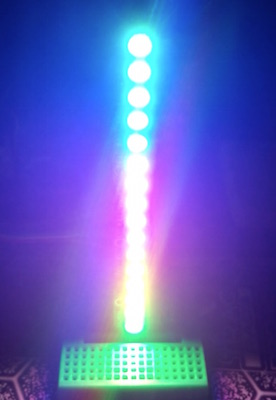

# router-beacon
Arduino Ethernet project to visibly show traffic levels on a DD-WRT based router using NeoPixels. Uses a strip of 16 NeoPixels to visually display how much traffic is being downloaded or uploaded through the WAN connection of the router. Pixel colors cycle for visual effect.

### How this works
This project requires requires a router running DD-WRT firmware for the Arduino to access for statistics. DD-WRT has a built in service that can be hit to fetch the current number of bytes transmitted and recieved. This service is located at: **http://IP_ADDRESS/fetchif.cgi?vlan1**. The output is the same as the output of /proc/net/dev on *nix operating systems. Here's an example output from calling the URL above:
```bash
Fri Jun 12 08:44:44 UTC 2015 vlan1:3545267273 45544710 0 0 0 0 0 1808728 655387916 36539186 0 0 0 0 0 0
```

There are a few numbers here, but the 2 main ones needed are the 1st and the 9th. The 1st is the total bytes received and the 9th is the total bytes transmitted. For the example above this means the total bytes recieved is 3545267273 and the total bytes transmitted is 655387916. By calling this service and keeping track of what the value was last time we called, we can subtract the previous value from the new value to determine KBps, which this project uses to determine how many pixels to light and color cycle.

*NOTE: The interface name ('vlan1') may need to change to the interface name for your WAN interface, depending on your configuration.*


